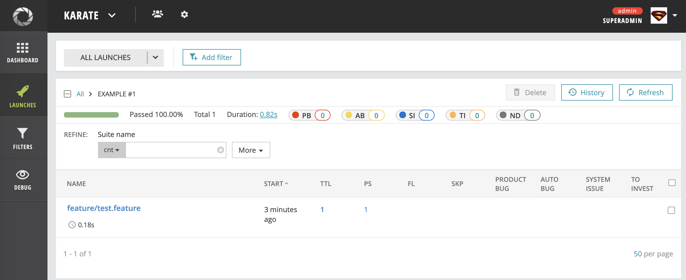

# agent-java-karate
##Java agent for the Karate Framework.
Follow next steps to apply the Karate agent to your project:
1. Add java-karate-agent dependency to you Maven or Gradle files:
    ```
    <dependencies>
        <dependency>
            <groupId>com.epam</groupId>
            <artifactId>agent-java-karate</artifactId>
            <version>1.1</version>
        </dependency>     
    </dependencies>
    ```
    or
    ``` 
    dependencies {
        testCompile 'com.epam:agent-java-karate:1.1'
    }
    ```
2. Add the reportportal.properties to your project;
3. Add logback of sl4j logger with ReportPortal portal appender;
4. In the test runner class add the following lines of code:
```
@Test
    public void testParallel() {
        Results results = AgentRunner.parallel(getClass(), 1);
    }
``` 
 number of threads can be set to any value that the Karate Framework can handle.

 AgentRunner class will run your tests and also create report in the ReporPortal.
 
Example of set up is provided in the test directory of the current project.

####Report will look like as follows:
All launches view:
 

Feature view:


Scenario view:


Steps view:


In case of errors the report will look like next:
 

